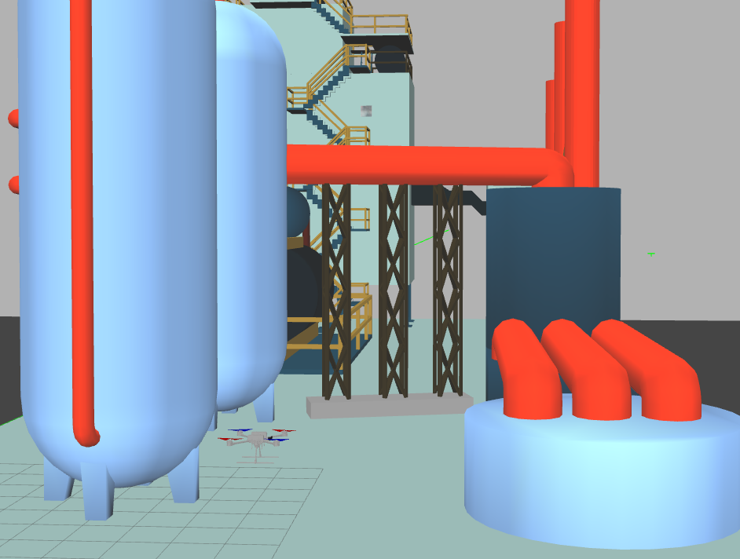
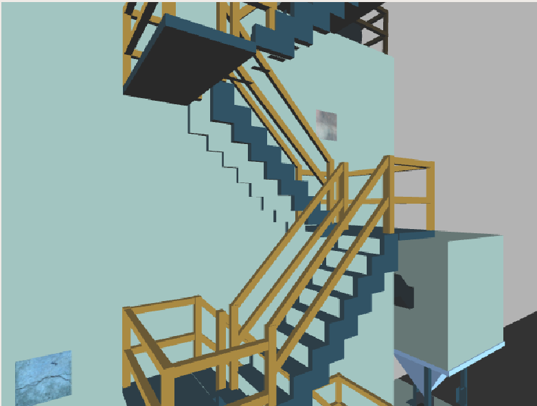

# ICUAS 2023 UAV Competition
The main repository for the ICUAS 2023 UAV competition.

If you're interested in publishing papers based on this repository, please cite the following publication:
```
@article{Markovic2023,
  doi = {10.1007/s10846-023-01909-z},
  url = {https://doi.org/10.1007/s10846-023-01909-z},
  year = {2023},
  month = jul,
  publisher = {Springer Science and Business Media {LLC}},
  volume = {108},
  number = {3},
  author = {Lovro Markovic and Frano Petric and Antun Ivanovic and Jurica Goricanec and Marko Car and Matko Orsag and Stjepan Bogdan},
  title = {Towards A Standardized Aerial Platform: {ICUAS}'22 Firefighting Competition},
  journal = {Journal of Intelligent {\&}amp$\mathsemicolon$ Robotic Systems}
}
```

## Install

You can either manually install the UAV software stack by following 
[uav_ros_simulation](https://github.com/larics/uav_ros_simulation) instruction or simply 
use Docker insted.

To install Docker on your system execute the following command:
```
curl https://raw.githubusercontent.com/larics/uav_ros_simulation/main/installation/dependencies/docker.sh | bash
```

## Troubleshooting

Checkout ```CHANGELOG.md``` for any new changes added to this project.

Feel free to use [Discussions](https://github.com/larics/icuas23_competition/discussions) tab to exchange ideas and ask questions.

Consider opening an [Issue](https://github.com/larics/icuas23_competition/issues) if you have troubles with the simulation setup.

**NOTE** - If the challenge does not setup correctly it is (probably) not your fault! Components are subject to some changes during the competition so most problems should be solved by updating packages. Try following the troubleshooting recommendation. If the problem persists please post an issue.

### Update this package
In case there are new changes to the challenge repository:
```bash
git pull origin main --rebase
catkin build
```

### Update Docker images
In case the Docker container simulation is not working correctly (e.g. an update happened):
```bash
git pull lmark1/uav_ros_simulation:[[DISTRO]]
```

In case the simulation inside the Docker container is (still) not working correctly:
```bash
./docker_build.sh --build-args "--no-cache --pull" --[[DISTRO]]
```

### Updating native installation
If you're building all the packages natively, navigate to the ```uav_ros_simulation``` folder and do the following:
```bash
git pull origin main
./installation/install.sh

# Navigate to catkin workspace (default is uav_ws)
catkin build
```

Update all code of the competition repo and build as follows:
```bash
git pull origin main
catkin build
```

## Build

You can either manually build all the packages on your system using the ```catkin build``` command.

Alternatively, to build the ICUAS2023 Competition solution image please execute the following command:
```
./docker_build.sh
```

Additional arguments:
* ```--focal``` - Build Docker image for Focal distro
* ```--focal-nogpu``` - Build Docker image for Focal distro (no dedicated graphics card)
* ```--build-args``` - Append additional Docker build arguments, e.g. --no-cache

## Startup

To automatically start and setup the challenge navigate to ```startup/challenge``` and run:
```
./start.sh
```
This should automatically setup and start the challenge, as well as run your code (see solution section in session.yml)

* Commands that run your challenge solution (rosrun, roslaunch etc.) should be placed in the ```session.yml``` file.
* Software configuration specific to the challenge should be placed in the ```custom_config``` folder.

**NOTE** If you are unfamiliar with the Docker or Tmux commands please check out this [quick-start guide](https://github.com/larics/uav_ros_simulation/blob/main/HOWTO.md).

**NOTE** If you choose to run the challenge inside the docker environment, please run the container first using:
```
./docker_run.sh
```

Additional arguments:
* ```--focal``` - Run Focal distro container
* ```--focal-nogpu``` - Run Focal distro container (no dedicated graphics card)
* ```--run-args``` - Append additional Docker run arguments, e.g. --rm

**NOTE** Keep in mind this will start a new container so any changes you make inside that container will be lost if you remove the container.
The idea of the container is to easily integrate your code with the challenge flight stack. To do so, please add your code diretcly to this ROS package since it is copied to the container. Furthermore, feel free to edit ```Dockerfile.focal``` or ```Dockerfile.bionic``` files to 
get all the resources and build your solution.

## Simulation

|  | 
|:--:| 
| UAV simulation template startup. Tmux session is running on the left side, with Gazebo client positioned on the right. |

### Controlling the UAV

For your reference, we have set up trajectory planning using TOPP-RA, which you can use by publishing to two topics:

* ```tracker/input_pose``` - Send a waypoint (PoseStamped) to TOPP-RA. TOPP-RA then interpolates trajectory between current UAV pose and the target waypoint, and sends trajectory points (MultiDOFJointTrajectoryPoint) to topic ```position_hold/trajectory``` with a given rate. The position controller of the UAV receives the trajectory point as a reference and commands the motors. 
* ```tracker/input_trajectory``` - Generate a trajectory using the given sampled path in form of waypoints (MultiDOFJointTrajectory). TOPP-RA then interpolates trajectory from the current UAV pose to the first point of the trajectory, and interpolates trajectory between sampled path points. Once trajectory is interpolated, each trajectory point is sent as a reference to the position controller via the ```position_hold/trajectory``` topic

To control the UAV directly, and to publish the trajectory that you generated via your solution, you need to use the following topic:
* ```position_hold/trajectory``` - Publish a trajectory point directly to the UAV position control

Current position reference (last one sent to the position controller of the UAV) can be obtained via ```carrot/pose``` topic, while current pose of the UAV (in simulation) is available at ```mavros/global_position/local``` topic.

### Configuration

Configuration files are placed in the ```startup/challenge/custom_config``` folder.

* [Position Control](startup/challenge/custom_config/position_control_custom.yaml)
* [TOPP Trajectory Generation](startup/challenge/custom_config/topp_config_custom.yaml)


### Points of interest

Point of interest are provided on the topic ```poi``` within the UAV namespace. The message contains an array of ```geometry_msgs/Point``` messages, containing x, y and z locations of a cylinder that contains a tile. The radius of each cylinder is 2.5 meters and the height of the cylinder is 5 meters. 

One PoI cylinder is spawned for each of the tiles, and they may overlap and include more than one tile. The cylinder may also include obstacles.

## Challenge

More details on the challenge can be found in the competition rulebook. After the UAV and the world is spawned, several textured tiles are spawned around the arena. The UAV needs to navigate the arena and find and classify tiles.

|  | 
|:--:| 
| UAV in the simulation arena for the ICUAS 2023 challenge. |

|  | 
|:--:| 
| View of several textured tiles from the UAV camera. |


### Important node for running your code
Remember that you should run your code alongside the existing setup through the session file. Use the existing solution section. You can use either existing waits to spawn your nodes or setup your nodes to listen to the following topic:

* ```challenge_started``` - After ```True``` is published on this topic the UAV is setup correctly.
* ```poi``` - After the array of points of interest is published on this topic the arena is setup correctly.

Make sure to wait for data on both topics to safely run your code.

### Changing the tile locations for testing
You can change tile locations through session file or spawn them from a separate terminal. Use position args to change the location of the tile. 

